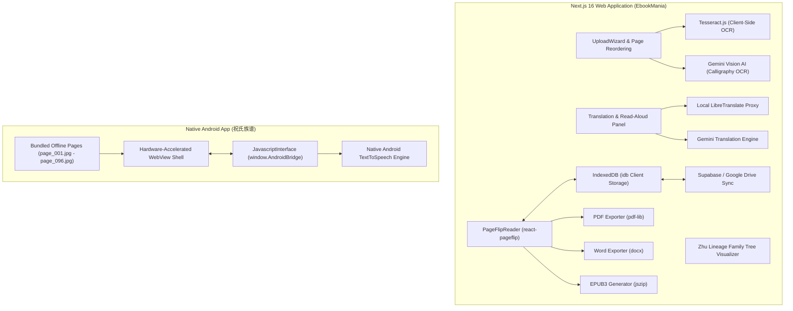

# 📜 祝氏族谱 (Zhu Lineage Reader & EbookMania)

> **Digital Historical Preservation Platform, Interactive 3D Page-Flipping Ebook, Ancestral Family Tree Visualizer, Multimodal OCR, AI Translation & Dedicated Android App**  
> Built for the web with **Next.js 16**, **React 19**, and **Tailwind CSS v4**, plus a standalone native **Android Application** (`com.zhulineage.reader`).

---

## 👨‍💻 Creator & Credits

- **Creator & Lead Architect:** **Dr. Timothy Tok**
- **Project:** **Zhu Lineage Genealogy (祝氏族谱) / EbookMania**
- **Repository:** [https://github.com/drtim83/ebook_zhu](https://github.com/drtim83/ebook_zhu)

---

## 🌟 Key Features

### 1. 📖 Realistic 3D Page-Flipping Reader
- **Skeuomorphic Reading Experience:** Powered by `react-pageflip` with authentic book-binding shadows, curling page physics, and smooth touch/swipe navigation.
- **Adaptive Display Modes:** Seamless toggle between single-page mobile layout and double-page spread desktop book layout.
- **Interactive Reading Utilities:** Fullscreen immersion mode, font magnification, bookmarking, and instant jump-to-page navigation.

### 2. 🌳 Interactive Zhu Clan Genealogy & Ancestral Family Tree (族谱世系图)
- **Deep Lineage Tracing:** Structured family tree visualization (`family_tree_data.js`) tracing generational lineages, ancestral branches, and historical biographies.
- **Biographical Context:** Integrates generational rankings, branch names, birth/death records, and historical lineage notes directly alongside scanned manuscript pages.

### 3. 🔍 Dual-Engine Optical Character Recognition (OCR)
- **Local In-Browser OCR (Tesseract.js):** Zero-server client-side optical character recognition. Scanned pages and rasterized PDF pages are processed completely in-browser with zero data transmitted externally.
- **Multimodal AI OCR (Google Gemini Vision):** Optional cloud-assisted AI OCR engine specialized in deciphering classical vertical calligraphy (文言文), faded woodblock prints, cursive scripts, and historical seals.
- **Vector PDF Rasterization:** Integrated `pdfjs-dist` pipeline to render uploaded documents into high-dpi canvas images prior to text recognition.

### 4. 🔢 Automated Page Number Detection & Sorting
- **Smart Heuristic Sorter:** Scans recognized text, image headers/footers, and file metadata to detect traditional Chinese or Arabic page numbers.
- **Drag-and-Drop Reordering:** Interactive visual page organizer allowing users to preview, rotate (90°/180°/270°), reorder, or delete individual scanned leaves before finalizing the book.

### 5. 🌐 Privacy-Preserving Neural Translation
- **Local Translation Proxy:** Built-in `/api/translate` endpoint interfacing with a self-hosted [LibreTranslate](https://github.com/LibreTranslate/LibreTranslate) Docker instance (`http://localhost:5000`) ensuring confidential family manuscripts never leave the local network.
- **Context-Aware Gemini AI Translation:** Direct browser-to-API integration with Google Gemini for nuanced translation of classical Chinese idioms, clan mottos, and archaic terminology into modern Chinese and English.

### 6. 🗣️ Multilingual Text-to-Speech (Read Aloud)
- **Web SpeechSynthesis Engine:** Built-in browser speech synthesis with real-time sentence highlighting and auto-scrolling page reading.
- **Android Native TextToSpeech:** Dedicated Android Java TTS bridge for high-fidelity speech synthesis without requiring an active internet connection.

### 7. 💾 Local-First Zero-Knowledge Architecture
- **IndexedDB Client Storage (`idb`):** Books, high-resolution scanned page images, transcriptions, and personal bookmarks are saved locally inside browser storage.
- **Cloud Synchronization:** Optional Supabase database synchronization and Google Drive OAuth integration for importing raw scans or archiving preserved collections.

### 8. 📤 High-Fidelity Multi-Format Export
- **Exact Scanned PDF:** Reconstructs the physical manuscript into a downloadable PDF utilizing `pdf-lib`.
- **Microsoft Word (.docx):** Compiles high-resolution page plates paired side-by-side with recognized text and translations using `docx`.
- **Standard EPUB3:** Hand-crafted EPUB3 package (`jszip`) compatible with Apple Books, Calibre, Kindle, and Kobo e-readers.

### 9. 📱 Standalone Native Android Application (`android_app`)
- **Package ID:** `com.zhulineage.reader` (App Name: **祝氏族谱**)
- **100% Offline Capability:** Pre-bundles historical scanned pages (`page_001.jpg` through `page_096.jpg`) and genealogical data directly in the app assets.
- **Hardware-Accelerated WebView:** Ultra-responsive native Java WebView shell with custom Javascript interfaces (`window.AndroidBridge`) for Android native haptics, full-screen controls, and system TTS.

---

## 🏛️ System Architecture



### Module Breakdown

1. **`src/app/` (Next.js App Router)**
   - `reader/[id]/page.tsx`: Interactive book reader portal with page-flipping mechanics.
   - `library/page.tsx`: Local digital bookshelf with search, tag filtering, and metadata editing.
   - `upload/page.tsx`: Multi-step upload wizard (upload -> rasterize -> OCR -> sort -> review -> save).
   - `settings/page.tsx`: Configuration portal for OCR engines, translation servers, and Gemini API keys.
   - `api/translate/route.ts`: Secure server-side translation proxy.

2. **`src/components/` & `src/lib/` (UI & Processing Core)**
   - `PageFlipReader.tsx`: 3D canvas page turning component.
   - `ocr.ts`, `pdf.ts`, `imageProcessing.ts`: Client-side image enhancement, binarization, and OCR pipelines.
   - `export/`: High-resolution export generators for PDF, DOCX, and EPUB3.
   - `db.ts`: IndexedDB database schemas and object stores.

3. **`android_app/` (Native Android Application)**
   - `MainActivity.java`: Native wrapper providing WebView optimizations and TextToSpeech engine.
   - `assets/`: Bundled offline HTML/JS/CSS reader, family tree data (`family_tree_data.js`), and complete book page scans.

---

## 💻 Tech Stack

| Domain | Technology / Library | Purpose |
| :--- | :--- | :--- |
| **Web Framework** | Next.js 16.3.0 + React 19.2.8 | Server-side rendering, App Router, and static asset streaming |
| **Styling** | Tailwind CSS v4 + PostCSS | Modern utility styling with dark mode and paper texture palettes |
| **Language** | TypeScript 5.x | Strict type safety for document parsing and data structures |
| **Page-Flip Engine** | `react-pageflip` ^2.0.3 | Realistic 3D skeuomorphic page turning physics |
| **Client-Side OCR** | `tesseract.js` ^7.0.0 | Pure browser OCR with offline multi-language model caching |
| **Cloud AI OCR & NLP** | Google Gemini API (`@google/genai`) | High-accuracy transcription of handwritten Chinese & translations |
| **PDF Processing** | `pdfjs-dist` ^6.2 + `pdf-lib` ^1.17 | Vector rasterization and programmatic PDF generation |
| **Document Export** | `docx` ^9.7 + `jszip` ^3.10 | Native DOCX document generation and EPUB3 compression |
| **Local Database** | `idb` ^8.0.3 (IndexedDB) | High-capacity browser storage for high-res page images |
| **Cloud & Storage** | `@supabase/supabase-js` ^2.116 | Optional cloud database and authentication integration |
| **Android Framework** | Android SDK (Java 17/21, Gradle 9) | Native Android wrapper with WebView and TextToSpeech |

---

## 📱 Pre-Built Android APK Location

A pre-built Android APK for the **祝氏族谱 (Zhu Lineage Reader)** is available:

| Target Device | APK File Path | Size |
| :--- | :--- | :--- |
| **Android Phone / Tablet** | [`android_app/app/build/outputs/apk/debug/app-debug.apk`](file:///Users/drtimothytok/VibeCoding/Ebook/android_app/app/build/outputs/apk/debug/app-debug.apk) | ~33 MB |

---

## 🚀 How to Install & Sideload the Android APK

### Method A: Via USB & ADB (Recommended for Developers)
1. Connect your Android device to your computer using a USB cable.
2. Ensure **USB Debugging** is turned ON in *Settings > Developer Options*.
3. From the `Ebook` project root, run:
   ```bash
   adb install -r android_app/app/build/outputs/apk/debug/app-debug.apk
   ```

### Method B: Direct Sideloading (No Computer Required)
1. Transfer `app-debug.apk` to your phone via **Quick Share**, Google Drive, USB storage, or email.
2. Open your phone's file manager (e.g., **Files by Google** or **My Files**).
3. Tap on `app-debug.apk`.
4. If prompted with *"Install unknown apps"*, tap **Settings** and enable **Allow from this source**.
5. Tap **Install** and open **祝氏族谱**.

---

## 🏗️ Getting Started & Web Development

### 1. Install Dependencies
```bash
npm install
```

### 2. Start the Development Server
```bash
npm run dev
```
Open [http://localhost:3000](http://localhost:3000) in your web browser.

### 3. Optional Local Translation Server
To run a local, completely private translation server without cloud APIs:
```bash
docker run -ti -p 5000:5000 libretranslate/libretranslate
```
Copy `.env.local.example` to `.env.local`:
```bash
cp .env.local.example .env.local
```

### 4. Building the Android App from Source
```bash
cd android_app

# Run debug build
./gradlew assembleDebug

# Output APK will be at:
# android_app/app/build/outputs/apk/debug/app-debug.apk
```

---

## 📄 License & Credits

Designed and developed by **Dr. Timothy Tok**.  
All rights reserved.
