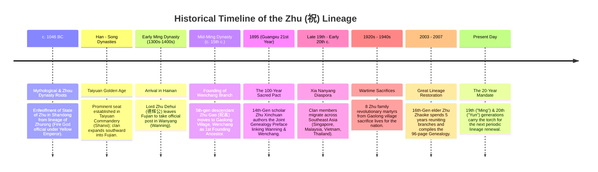

# Comprehensive Guide: Hainan Wenchang Zhu Family Lineage (文昌祝氏族谱)

A complete English reference detailing the historical timeline, simplified genealogical tree, overarching lineage summary, prominent figures, major milestones, and the generational naming poem code.

---

## 1. Historical Timeline of the Lineage



### Detailed Chronological Eras

* **Ancient Era (c. 1046 BC — Zhou Dynasty)**:
  According to historical records and the *Hundred Family Surnames* (where Zhu ranks 172nd), the family traces its ancestry to the Yellow Emperor through his descendant **Zhurong (祝融)**, who served as the Minister of Fire. King Wu of Zhou granted the feudal fiefdom of **Zhu** (east of modern Changqing, Shandong) to his descendants. The royal inhabitants adopted the state name as their surname.
* **Imperial Splendor & Taiyuan Seat (Han through Song Dynasties)**:
  Over the centuries, the clan flourished, establishing its preeminent ancestral seat in **Taiyuan Commandery (太原郡)**, modern Shanxi Province. This is why all formal documents in the lineage book carry the top hall mark *"Taiyuan Jun"* (太原郡). Over successive dynasties, branches migrated southeast to Jiangxi and Fujian (Dexing and Putian).
* **Early Ming Dynasty (c. late 1300s / 1400s) — Ocean Crossing to Hainan**:
  **Lord Zhu Dehui (德辉公)** left Dexing County, Fujian, upon being appointed as an imperial magistrate in Wanyang (modern-day Wanning / 万州), on the southern coast of Hainan Island.
* **Mid-Ming Dynasty — Establishment in Wenchang**:
  By the 5th generation on Hainan, the lineage branched into three houses. The second master, **Zhu Gao (祝高)**, journeyed north to northeastern Hainan and founded the Wenchang branch in **Gaolong Village (高隆村, Qinglan Town)**. He married Lady Yang (who passed away in Wanzhou) and later Lady Lin in Wenchang, becoming the **1st Generation Founding Ancestor of Wenchang**.
* **1895 (Qing Dynasty, 21st Year of Emperor Guangxu) — The Cross-County Covenant**:
  14th-generation scholar **Zhu Xinchuan (祝心传)** discovered that ties between the ancestral mother branch in Wanning and the branch in Wenchang were fading. He composed the *Joint Genealogy Preface* (祝氏联谱序), entering into a sacred mutual pact: whenever either branch updated its records, an exchange of books must take place so all descendants remember their common root.
* **Late 19th to Mid-20th Century — The Southern Ocean Migration (*Xia Nanyang* / 下南洋)**:
  Escaping regional hardships and war, dozens of family members journeyed overseas to British Malaya, Singapore, the Dutch East Indies, and Indochina. They established trading outposts like the "Jianhua Shop" (建华店) in Singapore and settled in peninsular Malaysia and Vietnam.
* **1927–1949 — Revolutionary Era & Martyrs**:
  During the anti-Japanese resistance and revolutionary wars, eight members of the Gaolong Village Zhu family gave their lives, commemorated in the official *Directory of Revolutionary Martyrs in Wenchang County*.
* **2003–2007 — Rediscovery and Publication**:
  Upon retiring at age 66 in Haikou, 16th-generation elder **Zhu Zhaoke (祝朝克)** realized the living memory of the lineage was crumbling. Over five seasons, he traveled through 20+ villages, investigated tombs, located the 1895 pact in Wanning, and published the authoritative 96-page *Hainan Wenchang Zhu Family Lineage* in November 2007 (including the restored Pages 82–83 spread).

---

## 2. Simplified Family Lineage Chart

```
                        [ANCIENT ROOTS]
                 Yellow Emperor (黄帝)
                          │
                     Zhurong (祝融)
                (Minister of Fire / 火正)
                          │
               State of Zhu (Shandong, 1046 BC)
                          │
             Taiyuan Commandery (Shanxi / 太原郡)
                          │
               Fujian Branch (Dexing / Putian)
                          │
=========================================================
            HAINAN ISLAND FOUNDING ANCESTOR
                 Lord Zhu Dehui (德辉公)
              (Imperial Official in Wanning)
                          │
                     [5 Generations]
                          │
=========================================================
           WENCHANG 1ST FOUNDING ANCESTOR
                 1st Gen: Zhu Gao (祝高)
             (Settled in Gaolong Village, Qinglan)
             m. Lady Yang (万州) & Lady Lin (文昌)
                          │
                 2nd Gen: Zhu Long (隆)
                          │
                 3rd Gen: Zhu Yi (裔)
                          │
             ┌─────────────┴─────────────┐
       4th: Zhu Jing (景)          4th: Zhu Ting (廷)
             │                           │
       5th: Tian (天)               5th: [Ting's Sons: Wenwang 文旺 & Wenhong 文弘]
             │                           ├───────────────────────────────────────────┐
       6th: Bi (必)                Wenwang (文旺公)                            Wenhong (文弘公)
             │                           │                                           │
   7th: Qiu / You / Chuan / Wen ┌────────┴────────┐                                  │
   (求 / 有 / 传 / 文)        Tianwei (天为)    Tianhua (天华)                   Tianzhong (天忠)
             │                  │                 │                                  │
   8th: Ji / Zhen (继 / 振)     6th: Biqi,        6th: Bi'en                         6th: Bihui,
             │                  Bishou, Biling     (必恩)                             Bichuan
             │                  │                 │                                  │
             │                  7th-8th:          7th-8th:                           7th-8th:
             │                  #66 Youyan (有严)  #74 Youpeng (有朋)                 #80 Youjian (有简)
             │                  #67 Youmao (有瑁)  #75 Youxin (有信)                  #81 Youjing (有璟)
             │                  #68 Youyi (有翼)   #76 Youjue (有觉)                  #82 Youneng (有能)
             │                  #69 Youmin (有敏)  #77 Youyan (有琰)
             │                  #70 Youlong (有隆) #78 Yougong (有恭)
             │                  #71 Youji (有纪)   #79 Youjian (有简)
             │                  #72 Youhui (有惠)      Youdeng (有登)
             │                  #73 Youhuan (有焕)
             │                           │
   [9th - 13th Generations: Local Branch Spread]
   (Gaolong, Xinqiao, Penglai, Longlou, Wenjiao, Xitian)
             │
  14th Gen: Xing (兴) ── [Zhu Xinchuan 祝心传, 1895 Pact Author]
            │
  15th Gen: Sheng (声) ── [Early Nanyang Emigrants to SE Asia]
            │
  16th Gen: Chao (朝) ── [Zhu Zhaoke 祝朝克, 2007 Lineage Author]
            │
  17th Gen: Jia (家) ─── [Zhu Jiameng / Zhaomeng, Manuscript Reviewer]
            │
  18th Gen: Sheng (圣) ── [Shengjin 圣进, Shengli 圣利 (Malaysia), etc.]
            │
=========================================================
       YOUR GENERATION (19th) & DESCENDANTS
  19th Gen: Ming (明 / 铭) ── [Mingcan 明灿, Mingwei, Mingcheng, etc.]
            │
  20th Gen: Yun (运) ──────── [Your Children / Next Gen]
            │
  21st Gen: Ji (际)
  22nd Gen: Chang (昌)
  23rd Gen: Qi (期)
  24th Gen: Ying (英)
  25th Gen: Xian (贤)
  26th Gen: Si (斯)
  27th Gen: Da (大)
  28th - 34th: Chong (崇), Sheng (盛), Mei (美), Xian (显), Rong (荣), Bang (邦), Guo (国)
```

---

## 3. Summary of the Whole Lineage

The **Hainan Wenchang Zhu Family Lineage (海南省文昌市 祝氏族谱)** is the ancestral chronicle of a celebrated southern Chinese family clan spanning over three millennia:
1. **Heritage**: Originating from the State of Zhu in Shandong and the Taiyuan Commandery of Shanxi, the family's migration mirrors the great historical southward movements of China's scholar-official class during the Song and Ming dynasties.
2. **Identity in Hainan**: Founded in Wenchang during the Ming Dynasty by Lord Zhu Gao, the family settled as agriculturalists, educators, and community leaders in Gaolong Village (Qinglan Town). The family preserved deep Confucian values: respect for ancestors, genealogical rigor, filial piety, and educational achievement.
3. **Global Diaspora (*Xia Nanyang*)**: During the late 19th and early 20th centuries, dozens of family members emigrated to Southeast Asia (Singapore, Malaysia, Vietnam, Thailand). Uniquely, the genealogy explicitly documents these overseas emigrants, their commercial enterprises, and their foreign addresses, ensuring that descendants abroad remain an inseparable part of the living lineage.
4. **Resilience**: The book records centuries of survival through piracy, dynasty transitions, World War II, and revolution—including the sacrifice of eight martyrs from Gaolong Village.

---

## 4. Key People in the Lineage

| Figure | Generation / Era | Significance & Role |
| :--- | :--- | :--- |
| **Zhurong (祝融)** | Antiquity (Mythological) | Minister of Fire under the Yellow Emperor; traditional progenitor of the Zhu clan. |
| **King Wu's Duke of Zhu** | 1046 BC (Zhou Dynasty) | Enfeoffed as ruler of the State of Zhu in Shandong; his clan adopted the state name as their surname. |
| **Lord Zhu Dehui (祝德辉)** | Early Ming Dynasty | The ancestral pioneer who sailed from Putian/Dexing, Fujian to Hainan Island to serve as magistrate in Wanyang (Wanning). |
| **Lord Zhu Gao (祝高)** | **1st Generation** (Wenchang Founder) | Migrated north from Wanzhou to Gaolong Village, Wenchang. Established the ancestral seat, married Lady Yang and Lady Lin, and began the 21-generation Wenchang family line. |
| **Zhu Long (祝隆)** | **2nd Generation** | Son of Zhu Gao and Lady Lin; expanded the family settlement in Gaolong Village. |
| **Zhu Xinchuan (祝心传)** | **14th Generation** (Late Qing, 1895) | Respected scholar and official; authored the landmark *Joint Genealogy Preface* (祝氏联谱序), binding the Wanning and Wenchang branches in an eternal pact of mutual remembrance. |
| **Zhu Zhaoke (祝朝克)** | **16th Generation** (Author, 2007) | Dedicated his retirement (2003–2007) to crisscrossing Hainan Island, locating old grave markers, reconnecting with Wanning relatives, and authoring the unified 96-page Lineage Book. |
| **Zhu Zhaomeng (祝朝孟 / 家孟)** | **17th Generation** | Lineage elder who assisted and reviewed Zhu Zhaoke's draft manuscript. |
| **Zhu Shengjin (祝圣进)** | **18th Generation** | Key patriarchal elder of the 18th generation directly preceding the contemporary family cluster. |
| **Zhu Mingcan (祝明灿 / 铭灿)** | **19th Generation** (Current) | Recorded on pages 44–45 alongside generational brothers (Mingwei, Mingcheng, Mingjian, Mingtai), representing the contemporary torchbearers of the family. |

---

## 5. Key Historical Events

1. **Enfeoffment of the State of Zhu (1046 BC)**: Establishment of the royal clan name following the fall of the Shang Dynasty.
2. **Magisterial Dispatch to Hainan (14th Century)**: Lord Dehui's southward journey from Fujian across the Qiongzhou Strait, taking office in Wanning.
3. **Pioneering of Gaolong Village (Mid-15th Century)**: Zhu Gao establishing his homestead in Wenchang, planting the roots that would flourish for over five centuries.
4. **The Pact of Guangxu (Autumn 1895)**: Scholar Zhu Xinchuan writing the cross-branch treaty, establishing that genealogical copies must always be exchanged between Wanning and Wenchang.
5. **The Southeast Asian Diaspora (*Xia Nanyang*)**: Emigration to Singapore, Malaysia, and Vietnam in the late 19th and early 20th centuries, turning the family into an international lineage.
6. **Sacrifice of the Eight Revolutionary Martyrs**: Clan members laying down their lives in the 20th-century national struggles, enshrined in Guangdong historical records.
7. **The Five-Year Pilgrimage and Publication (2003–2007)**: Elder Zhu Zhaoke's recovery campaign, concluding in November 2007 with the printing of the official *Wenchang Zhu Family Lineage*.
8. **The 20-Year Mandate (Current Era)**: The mandate from the 2007 preface commanding descendants to reconvene every 20–30 years to update and preserve the records.

---

## 6. The Generational Naming Code Poem (字辈 / 派序)

In Chinese lineage tradition, a **Generation Poem (字辈, *Zibei*)** serves as a rhythmic cryptographic code. Each boy born into a generation is given a two-character personal name where the first character is pre-determined by the poem. This guarantees that any two family members anywhere on Earth can instantly identify their exact genealogical seniority and relationship.

### The Official Wenchang Zhu Generational Poem

| Gen | Chinese | Pinyin | Literal Meaning | Philosophical Interpretation |
| :---: | :---: | :---: | :---: | :--- |
| **1st** | **祖 / 高** | Zǔ / Gāo | Ancestor / Eminent | The foundational patriarch of Wenchang. |
| **2nd** | **隆** | Lóng | Prosperous / Grand | The flourishing expansion of the early homestead. |
| **3rd** | **裔** | Yì | Descendants / Lineage | The branches taking deep root in the soil. |
| **4th** | **景 / 廷** | Jǐng / Tíng | Scenery / Royal Court | Public service and honor in the imperial era. |
| **5th** | **天** | Tiān | Heaven / Providence | Reverence for the moral order of heaven. |
| **6th** | **必** | Bì | Certainty / Resoluteness | Uncompromising determination and integrity. |
| **7th** | **求 / 有 / 传 / 文** | Qiú / Yǒu / Chuán / Wén | Seek / Possess / Transmit / Culture | Pursuit of education, wisdom, and cultural heritage. |
| **8th** | **继 / 振** | Jì / Zhèn | Succeed / Invigorate | Upholding the ancestors' achievements with fresh vigor. |
| **9th–13th** | *(Local)* | — | *(Local branch variants)* | Period of decentralized expansion across Hainan villages. |
| **14th** | **兴** | Xīng | Prosper / Rise | Reinvigoration of the clan (era of Zhu Xinchuan). |
| **15th** | **声** | Shēng | Voice / Renown / Fame | Making the family name celebrated across the seas. |
| **16th** | **朝** | Cháo | Dynasty / Dawn / Court | Diligence and service (era of author Zhu Zhaoke). |
| **17th** | **家** | Jiā | Family / Home / Household | Strengthening household ethics and family unity. |
| **18th** | **圣** | Shèng | Sage / Holy / Virtuous | Reverence for classical wisdom and sage-like character. |
| **19th** | **明 / 铭** | **Míng** | **Bright / Clear / Inscribed** | **Your Generation** (Mingcan 明灿, etc.) — Enlightenment and memory. |
| **20th** | **运** | **Yùn** | **Fortune / Destiny / Momentum** | **Your Children's Generation** — Riding the tides of modern fortune. |
| **21st** | **际** | Jì | Juncture / Intersection | Meeting historic opportunities on the world stage. |
| **22nd** | **昌** | Chāng | Flourishing / Thriving | Long-lasting prosperity and abundance. |
| **23rd** | **期** | Qī | Hope / Anticipation | Great expectations fulfilled by worthy successors. |
| **24th** | **英** | Yīng | Heroic / Outstanding | Talented individuals excelling in diverse fields. |
| **25th** | **贤** | Xián | Virtuous / Worthy | Moral uprightness and benevolence toward society. |
| **26th** | **斯** | Sī | Elegant / "This" | Classical decorum and cultured conduct. |
| **27th** | **大** | Dà | Great / Vast / Magnanimous | Broad-minded vision and noble achievements. |
| **28th** | **崇** | Chóng | Sublime / Revered | Elevated status and ethical dignity. |
| **29th** | **盛** | Shèng | Abundant / Majestic | The height of collective clan flourishing. |
| **30th** | **美** | Měi | Beautiful / Harmonious | Harmonious relations and aesthetic grace. |
| **31st** | **显** | Xiǎn | Prominent / Manifest | Brightly displaying the family's contributions to the world. |
| **32nd** | **荣** | Róng | Glory / Honor | Honorable legacy bestowed upon future generations. |
| **33rd** | **邦** | Bāng | Nation / State | Serving the broader commonwealth and community. |
| **34th** | **国** | Guó | Country / Civilization | True citizenship and service to humanity. |

---

## 7. The Direct Command for the 19th and 20th Generations

In the concluding foreword of the 2007 book, compiler Zhu Zhaoke issued a direct generational charge to his successors:

> **「世世代代，继续努力，隔二、三十年，续修一次。告慰先祖，启蒙后代。」**
> 
> *"Generation after generation, continue the effort; update this genealogy every 20 or 30 years. To comfort the ancestors, and enlighten the descendants."*

As 2027 marks the 20th anniversary of the 2007 book, this digital conversion, English translation, and offline Android reader directly fulfill this generational mission—preserving the roots for family members around the world.
